# 🐧 ParoCyber Linux Assignment

**Author:** Yaa Kesewaa Yeboah
**GitHub:** [Yaa-K](https://github.com/Yaa-K)
**Facilitator:** Samuel Nartey Otuafo
**Organisation:** ParoCyber LLC

---

## 📌 Overview

This repository documents my completion of the ParoCyber Linux Assignment — a set of 10 hands-on scenarios covering real-world Linux security, file management, process control, and DevSecOps practices.

Each scenario simulates an incident that could happen in a production environment. The goal is to reproduce the problem, understand why it happened, and apply the correct fix.

---

## 📁 Repository Structure

```
parocyber-linux-assignment/
├── README.md                  ← This file (full documentation)
├── scripts/
│   ├── run_all_scenarios.sh   ← Master script for all scenarios
│   └── incident_report.txt   ← Heredoc-generated report (Scenario 10)
└── screenshots/
    ├── scenario_01_task_a1.png
    ├── scenario_01_task_a2.png
    ├── scenario_01_task_b.png
    ├── scenario_01_task_c.png
    ├── scenario_02.png
    ├── screenshot_11_backup_with_metadata.png
    ├── screenshot_12_applog_chattr_a.png
    ├── screenshot_13_append_ok_overwrite_blocked_log.png
    ├── screenshot_14_files_with_permissions.png
    ├── screenshot_15_ownership_changed.png
    ├── screenshot_16_cp_with_without_p.png
    ├── screenshot_07_deployment_failure.png
    ├── screenshot_08_deployment_fixed.png
    ├── screenshot_09_links_created.png
    ├── screenshot_10_hardlink_works_symlink_broken.png
    ├── screenshot_11_grep_scan.png
    ├── screenshot_12_findings_combined.png
    ├── screenshot_13_sticky_bit_applied.png
    ├── screenshot_14_cross_deletion_blocked.png
    ├── screenshot_16_task8b_setgid.png
    ├── screenshot_17_task8c_setuid.png
    ├── screenshot_18_process_identified.png
    ├── screenshot_19_process_terminated.png
    └── screenshot_20_incident_report.png
```

---

## ✅ Scenarios Completed

| # | Scenario | Status |
|---|----------|--------|
| 1 | Shared Document Deletion Incident | ✅ Complete |
| 2 | Log Overwrite Incident | ✅ Complete |
| 3 | Permission & Ownership Drift | ✅ Complete |
| 4 | Relative Path Deployment Failure | ✅ Complete |
| 5 | Monitoring Failure After Log Cleanup | ✅ Complete |
| 6 | Sensitive Data Exposure Hunt | ✅ Complete |
| 7 | Shared Directory Stability Controls | ✅ Complete |
| 8 | Special Permission Risk Review | ✅ Complete |
| 9 | Process Anomaly Investigation | ✅ Complete |
| 10 | Incident Documentation via Heredoc | ✅ Complete |

---

## 📖 Scenario Walkthroughs

---

### Scenario 1 – Shared Document Deletion Incident

**Context:** An intern accidentally deleted a shared design document. The goal is to reproduce the incident and prevent it from happening again.

#### Part A – Multi-User Simulation

Created three users and a shared group to simulate a real team environment.

```bash
sudo useradd -m intern_a
sudo useradd -m dev_user
sudo useradd -m ops_user
sudo groupadd project_team
sudo usermod -aG project_team intern_a
sudo usermod -aG project_team dev_user
sudo usermod -aG project_team ops_user
getent group project_team
```

**Evidence:**

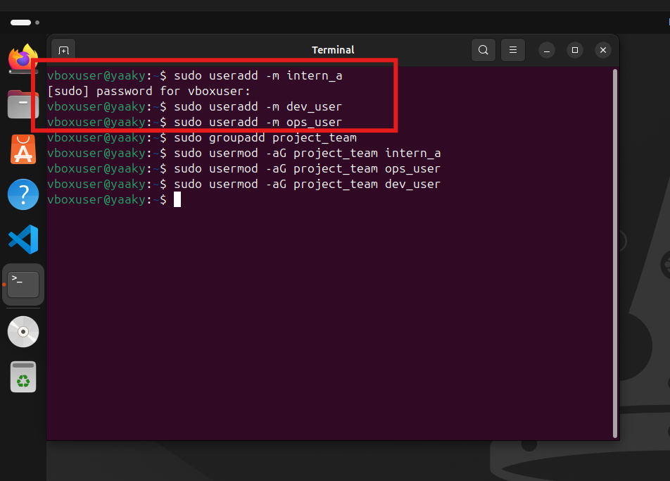
*Users created successfully*

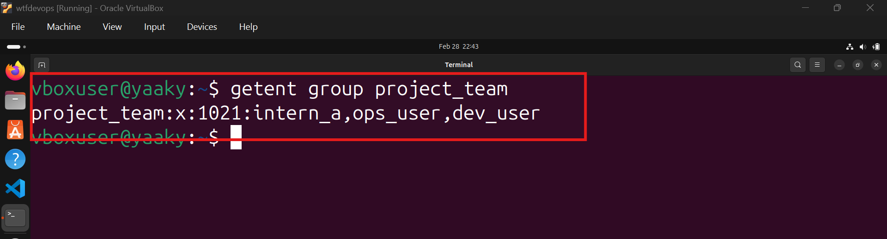
*getent confirming all three users are members of project_team*

#### Part B – Reproducing the Incident

Created the shared directory and file, then logged in as `intern_a` to delete it.

```bash
sudo mkdir -p /srv/project_shared
sudo chown root:project_team /srv/project_shared
sudo chmod 770 /srv/project_shared
sudo -u dev_user bash -c 'echo "Version 1.0" > /srv/project_shared/shared_design.doc'
ls -la /srv/project_shared/
sudo -u intern_a bash -c 'rm /srv/project_shared/shared_design.doc && echo "FILE DELETED!"'
ls /srv/project_shared/
```

**Evidence:**

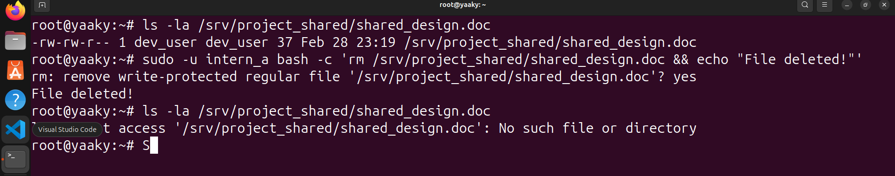
*FILE DELETED! message and empty directory — incident successfully reproduced*

**Observation:** With `chmod 770`, write permission on the directory grants any group member the ability to delete any file inside it, regardless of who created it. This is a fundamental Linux behaviour that many people overlook.

#### Part C – Preventing Recurrence

Applied `chattr +i` (immutable) to block deletion at the filesystem level.

```bash
sudo -u dev_user bash -c 'echo "Version 1.0" > /srv/project_shared/shared_design.doc'
sudo chattr +i /srv/project_shared/shared_design.doc
lsattr /srv/project_shared/shared_design.doc
su - intern_a 
rm /srv/project_shared/shared_design.doc 2>&1'
```

**Evidence:**

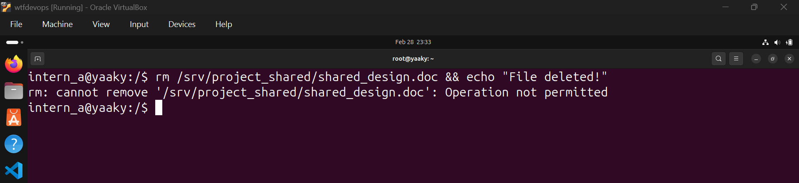
*lsattr showing ----i--- flag set AND Operation not permitted error — deletion blocked*

**Security Implications:**

| Approach | Layer | Can root bypass? |
|----------|-------|-----------------|
| `chmod 770` | DAC (kernel permissions) | Yes |
| `chattr +i` | VFS filesystem flags | Only after running `chattr -i` first |
| `chattr +a` | VFS filesystem flags | Only after running `chattr -a` first |

- **Why permissions alone failed:** `chmod` controls read/write/execute, but write permission on a *directory* means delete rights on everything inside it — regardless of file ownership.
- **`chattr` vs `chmod`:** `chattr` operates at the VFS layer, below normal permission checks. Even root cannot delete a `+i` file without explicitly removing the attribute first.
- **`+i` vs `+a`:** `+i` is fully immutable — nothing can change. `+a` is append-only — data can be added but not overwritten or deleted. Use `+a` for log files, `+i` for configs that should never change.

---

### Scenario 2 – Log Overwrite Incident

**Context:** Application logs were accidentally overwritten with `>`, destroying all forensic history.

#### Commands Executed

```bash
# Create log with 100+ lines
mkdir -p ~/logs ~/archive
history > ~/logs/app.log
wc -l ~/logs/app.log

# Simulate the overwrite
echo "ACCIDENTAL OVERWRITE" > ~/logs/app.log
wc -l ~/logs/app.log

# Restore, backup with metadata, and protect
history > ~/logs/app.log
cp -p ~/logs/app.log ~/archive/app.log.bak
sudo chattr +a ~/logs/app.log
lsattr ~/logs/app.log
```

**Evidence:**

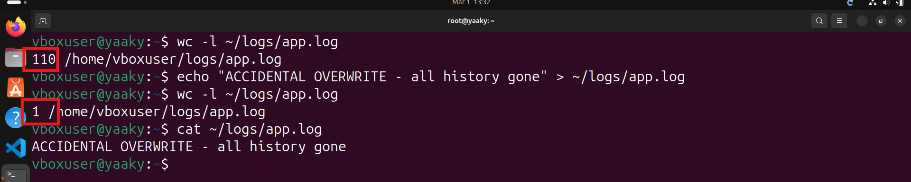
*Two wc -l outputs: 100+ lines before, 1 line after overwrite — the incident. Then lsattr showing +a flag with APPEND: OK and OVERWRITE BLOCKED.*

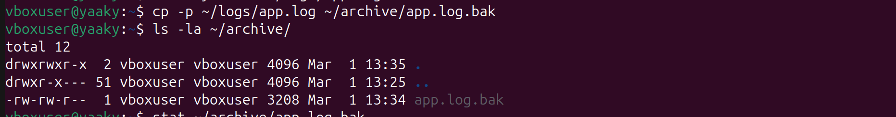
*ls -la of ~/archive/ showing app.log.bak with original timestamps preserved via cp -p*

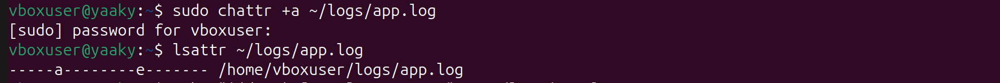
*lsattr confirming append-only flag set on app.log*

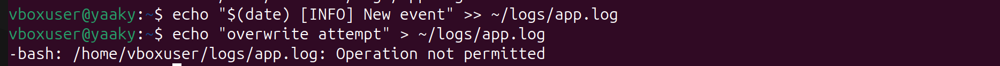
*APPEND: OK followed by OVERWRITE BLOCKED — protection confirmed*

**Observations & Security Implications:**
- **Why log overwrites are dangerous:** The `>` operator truncates the file to zero bytes before writing — all 100+ lines are gone in an instant.Logs are the primary evidence in any incident investigation. Losing them means losing the timeline of what happened.
- `>>` appends safely without touching existing content. This should always be the default for log pipelines.
- **Importance of metadata preservation:** `cp -p` preserves timestamps (mtime, atime) which are critical evidence in forensic timelines. Without them, a backup file loses its evidentiary value.
- `chattr +a` enforces append-only at the filesystem level, independent of user permissions — even a misconfigured script running as root cannot overwrite the file.
- In regulated environments, log integrity is a mandatory control.
- **DevSecOps forensic significance:** In CI/CD pipelines, logs record every deployment and build. If they can be overwritten, malicious changes can be hidden. Append-only logs with centralised shipping to a SIEM create a tamper-evident trail that survives even if the local machine is compromised.
---

### Scenario 3 – Permission & Ownership Drift

**Context:** Files copied across directories silently lose their correct ownership and permissions.

#### Commands Executed

```bash
# Create files with varying permissions
mkdir -p ~/drift_test/{source,dest_normal,dest_preserved}
echo "Confidential" > ~/drift_test/source/secret.txt
echo "Public"       > ~/drift_test/source/public.txt
chmod 600 ~/drift_test/source/secret.txt
chmod 644 ~/drift_test/source/public.txt
sudo chown dev_user:project_team ~/drift_test/source/secret.txt
sudo chgrp project_team ~/drift_test/source/public.txt

# Copy without -p (no preservation)
cp ~/drift_test/source/secret.txt ~/drift_test/dest_normal/

# Copy with -p (preserve attributes)
cp -p ~/drift_test/source/secret.txt ~/drift_test/dest_preserved/

# Compare
echo "--- WITHOUT -p ---"
ls -la ~/drift_test/dest_normal/
echo "--- WITH -p ---"
ls -la ~/drift_test/dest_preserved/
```

**Evidence:**

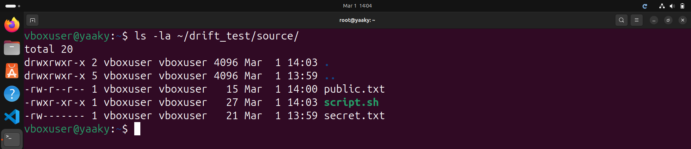
*Initial files with 600 and 644 permissions set*

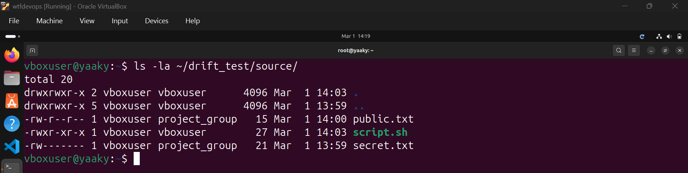
*Ownership changed — secret.txt now owned by vboxuser:project_group*

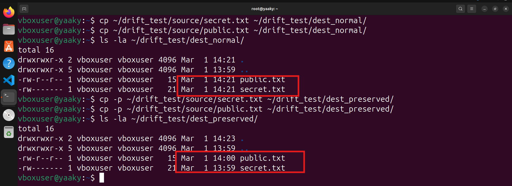
*Side by side: dest_normal shows ownership reset to current user; dest_preserved keeps vboxuser ownership and original timestamps*

**Observations:**

| Copy Method | Permissions | Ownership | Timestamps |
|-------------|-------------|-----------|------------|
| `cp` (plain) | May differ | Reset to current user | Reset to now |
| `cp -p` | Preserved | Best-effort | Preserved |

**Security Implication:** A config file intended to be `root:root 640` silently becomes `youruser:yourgroup 640` after a careless copy — potentially exposing secrets to a wider audience without anyone noticing.

---

### Scenario 4 – Relative Path Deployment Failure

**Context:** A deployment script copied the wrong data because it used relative paths, which break when the script is run from a different directory.

#### Commands Executed

```bash
# Setup
mkdir -p ~/deployments/app/config
echo "db_host=localhost" > ~/deployments/app/config/settings.conf

# Bad script — uses relative path
cat > ~/deployments/deploy_bad.sh << 'EOF'
#!/bin/bash
cp config/settings.conf /tmp/deployed.conf
echo Deployed: $(cat /tmp/deployed.conf)
EOF
chmod +x ~/deployments/deploy_bad.sh

# Trigger the failure from a different directory
cd /tmp
bash ~/deployments/deploy_bad.sh

# Fixed script — uses absolute path
cat > ~/deployments/deploy_good.sh << 'EOF'
#!/bin/bash
cp ~/deployments/app/config/settings.conf /tmp/deployed.conf
echo Deployed: $(cat /tmp/deployed.conf)
EOF
chmod +x ~/deployments/deploy_good.sh
bash ~/deployments/deploy_good.sh
cd ~
```

**Evidence:**

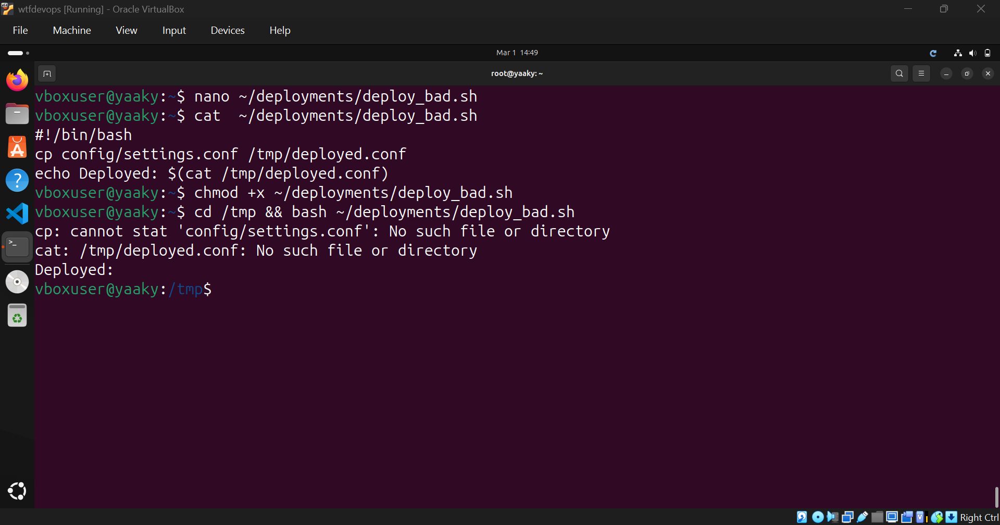
*cp: cannot stat 'config/settings.conf': No such file or directory — script fails from /tmp*

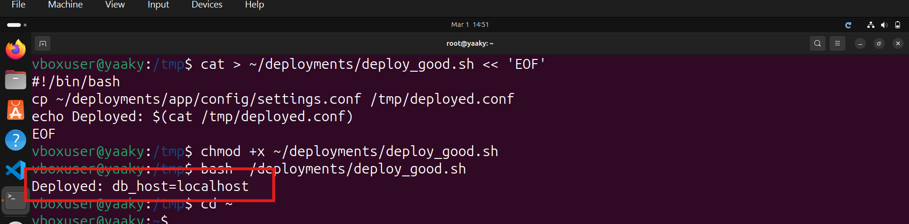
*Deployed: db_host=localhost — absolute path works from any directory*

**Explanation:** Relative paths resolve against the current working directory (CWD) at the time the script runs. In CI/CD pipelines, scripts are often invoked from scheduler directories, temp folders, or the root — none of which match what the script author assumed. Absolute paths are deterministic and always work regardless of where the script is called from.

---

### Scenario 5 – Monitoring Failure After Log Cleanup

**Context:** A log file was removed, causing monitoring to fail. The behaviour differs depending on whether a hard link or symbolic link was used.

#### Commands Executed

```bash
mkdir -p ~/inode_test
echo "Log line 1" >  ~/inode_test/original.log
echo "Log line 2" >> ~/inode_test/original.log

# Create hard link (same inode)
ln    ~/inode_test/original.log ~/inode_test/hardlink.log

# Create symbolic link (new inode, stores path string)
ln -s ~/inode_test/original.log ~/inode_test/symlink.log

ls -li ~/inode_test/

# Remove the original
rm ~/inode_test/original.log

# Test both
cat ~/inode_test/hardlink.log
cat ~/inode_test/symlink.log 2>&1
```

**Evidence:**

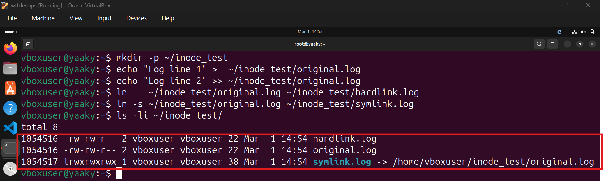
*ls -li showing original.log and hardlink.log share the same inode number; symlink.log has a different inode and points to original.log*

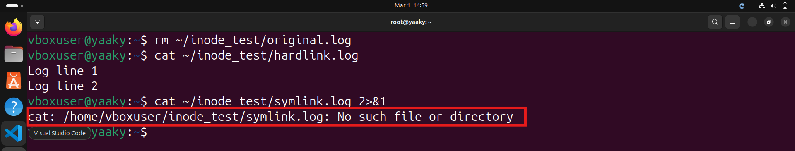
*After rm: hardlink.log prints content fine; symlink.log gives No such file or directory*

**Inode Behaviour:**

```
Hard link:   [hardlink.log] ──→ [Inode 12345] ──→ [Data Blocks]
             [original.log] ──→ [Inode 12345] ──→ (same data)
             After rm: inode link count drops to 1, data survives

Symlink:     [symlink.log]  ──→ "/path/to/original.log"
             After rm: path lookup fails — dangling symlink
```

**Security & Operational Implication:** Monitoring agents that use `tail -f` via a symlink lose the feed the moment the original file is rotated or removed. Hard links or inode-aware file watchers (such as those using `inotify`) maintain continuity through log rotation.

---

### Scenario 6 – Sensitive Data Exposure Hunt

**Context:** The security team suspects secrets and credentials are exposed in plaintext inside log and config files.

#### Commands Executed

```bash
# Create test files with fake secrets
mkdir -p ~/secret_hunt/{configs,logs,results}
echo "DB_PASSWORD=SuperSecret123" > ~/secret_hunt/configs/app.conf
echo "API_KEY=sk-abc123xyz"      >> ~/secret_hunt/configs/app.conf
echo "Normal log line"           > ~/secret_hunt/logs/app.log
echo "token=abc.def.ghi"        >> ~/secret_hunt/logs/app.log

# Recursive scan
grep -ri 'password' ~/secret_hunt/
grep -ri 'api_key'  ~/secret_hunt/

# Multi-expression scan, save with > (overwrite)
grep -ri -e 'password' -e 'api_key' -e 'token' \
  ~/secret_hunt/ > ~/secret_hunt/results/findings.txt
cat ~/secret_hunt/results/findings.txt

# Pattern file scan, append with >>
cat > ~/secret_hunt/patterns.txt << 'EOF'
password
api_key
token
EOF
grep -ri -f ~/secret_hunt/patterns.txt \
  ~/secret_hunt/logs/ >> ~/secret_hunt/results/findings.txt
wc -l ~/secret_hunt/results/findings.txt
cat ~/secret_hunt/results/findings.txt
```

**Evidence:**

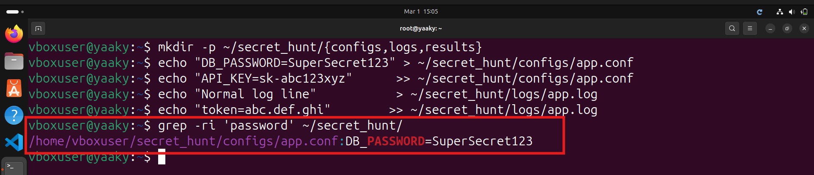
*Recursive grep results showing matched lines containing sensitive keywords across multiple files*

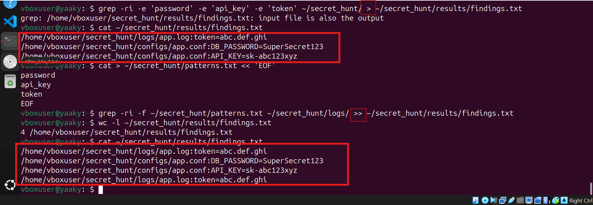
*findings.txt shown after > (initial results) and after >> (more lines appended from pattern file scan)*

**Why Both `>` and `>>` Were Used:**

| Operator | Behaviour | Purpose in this scenario |
|----------|-----------|--------------------------|
| `>` | Truncates and overwrites | Start a clean findings file for this scan session |
| `>>` | Appends without destroying | Accumulate results from subsequent tool passes |

**Security Implications:** Passwords, API keys, tokens, and AWS credentials found in plaintext represent a critical exposure. Immediate remediation steps: rotate all exposed credentials, use a secrets manager (HashiCorp Vault, AWS Secrets Manager), and add pre-commit hooks (`git-secrets`, `truffleHog`) to prevent future leaks.

---

### Scenario 7 – Shared Directory Stability Controls

**Context:** Developers reported files disappearing from a shared directory. Other team members were deleting each other's files.

#### Commands Executed

```bash
sudo mkdir -p /srv/shared_collab
sudo chown root:project_team /srv/shared_collab
sudo chmod 770 /srv/shared_collab

# Each user creates a file
sudo -u dev_user bash -c 'echo "dev file" > /srv/shared_collab/dev_notes.txt'
sudo -u intern_a bash -c 'echo "intern file" > /srv/shared_collab/intern_notes.txt'

# Apply sticky bit
sudo chmod +t /srv/shared_collab
ls -ld /srv/shared_collab

# intern_a tries to delete dev_user's file
sudo -u intern_a bash -c 'rm /srv/shared_collab/dev_notes.txt 2>&1'
ls -la /srv/shared_collab/
```

**Evidence:**

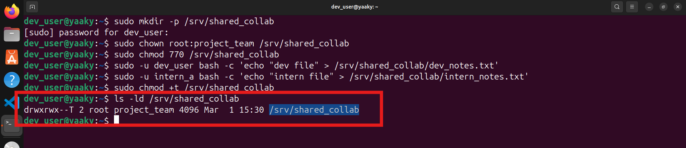
*ls -ld showing drwxrwx--T — the T at the end confirms the sticky bit is set*

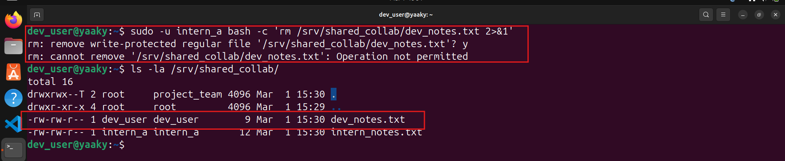
*Operation not permitted — intern_a cannot delete dev_user's file. ls confirms dev_notes.txt still exists.*

**Mechanism & Security Reasoning:** The sticky bit changes deletion semantics on a directory. Without it, group write permission means any group member can delete any file. With it, only the file owner, directory owner, or root can delete a file. File creation remains open to everyone in the group. This is the same mechanism used on `/tmp` (which runs as `1777`) across all Linux systems.

---

### Scenario 8 – Special Permission Risk Review

**Context:** A payments platform directory structure requires careful use of setuid, setgid, and sticky bit permissions.

#### Task 8A – Sticky Bit on the Shared Directory

```bash
mkdir -p ~/company_projects/payments_platform/environments/production/services/api/shared
sudo chown root:project_team ~/company_projects/payments_platform/environments/production/services/api/shared
sudo chmod 770 ~/company_projects/payments_platform/environments/production/services/api/shared
sudo -u dev_user bash -c 'echo notes > ~/company_projects/payments_platform/environments/production/services/api/shared/project_notes.txt'
sudo chmod +t ~/company_projects/payments_platform/environments/production/services/api/shared
ls -ld ~/company_projects/payments_platform/environments/production/services/api/shared
sudo -u intern_a bash -c 'rm ~/company_projects/payments_platform/environments/production/services/api/shared/project_notes.txt 2>&1'
```

*Evidence: screenshot_15_task8a_sticky.png — covered by Scenario 7 screenshots (same behaviour demonstrated on the deep path)*

#### Task 8B – SetGID Group Inheritance

```bash
sudo chmod g+s ~/company_projects/payments_platform/environments/production/services/api/shared
mkdir -p ~/company_projects/payments_platform/environments/production/services/api/shared/team_docs
sudo -u intern_a bash -c 'echo hello > ~/company_projects/payments_platform/environments/production/services/api/shared/team_docs/notes.txt'
sudo -u intern_a bash -c 'mkdir ~/company_projects/payments_platform/environments/production/services/api/shared/team_docs/drafts'
ls -la ~/company_projects/payments_platform/environments/production/services/api/shared/team_docs/
```

**Evidence:**

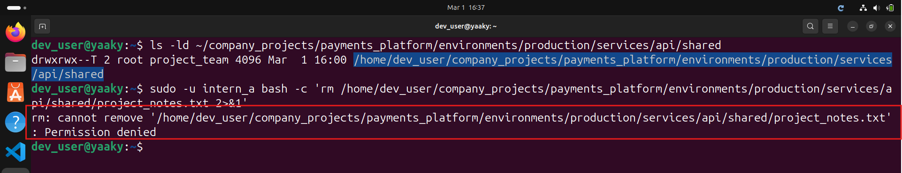
*notes.txt and drafts/ both show project_team as their group owner, even though intern_a created them — SetGID inheritance confirmed*

**Why SetGID matters:** Without it, new files created by `intern_a` inherit `intern_a`'s primary group, which other team members may not have access to. With SetGID on the directory, every new file and subdirectory automatically inherits the directory's group (`project_team`), ensuring consistent access for the whole team with no manual `chgrp` needed.

#### Task 8C – SetUID: `s` vs `S`

```bash
mkdir -p ~/company_projects/payments_platform/environments/production/services/api/bin
echo '#!/bin/bash' > ~/company_projects/payments_platform/environments/production/services/api/bin/run_task.sh
chmod 755 ~/company_projects/payments_platform/environments/production/services/api/bin/run_task.sh

# Apply setuid with execute — lowercase s
chmod u+s ~/company_projects/payments_platform/environments/production/services/api/bin/run_task.sh
ls -l ~/company_projects/payments_platform/environments/production/services/api/bin/run_task.sh

# Remove execute — uppercase S appears
chmod u-x ~/company_projects/payments_platform/environments/production/services/api/bin/run_task.sh
ls -l ~/company_projects/payments_platform/environments/production/services/api/bin/run_task.sh
```

**Evidence:**

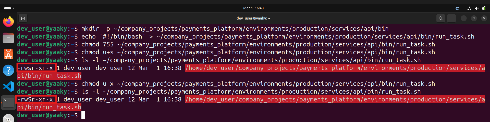
*Two ls -l outputs: -rwsr-xr-x (lowercase s = setuid active), then -rwSr-xr-x (uppercase S = setuid without execute = misconfiguration)*

**`s` vs `S` explained:**

| Symbol | Meaning | Implication |
|--------|---------|-------------|
| `s` (lowercase) | setuid set AND execute bit present | File runs with the owner's effective UID |
| `S` (uppercase) | setuid set but NO execute bit | Setuid is meaningless — file cannot even run. Always a misconfiguration. |

> **Important note:** Linux silently ignores setuid on shell scripts by design. SetUID only takes effect on compiled ELF binaries. For privilege control on scripts, use `sudo` policies instead.

**Audit command to find all setuid/setgid files on a system:**
```bash
find / -perm /6000 -type f 2>/dev/null
```

---

### Scenario 9 – Process Anomaly Investigation

**Context:** System slowdown was reported. A rogue process was identified consuming excessive CPU and needed to be controlled and terminated safely.

#### Commands Executed

```bash
# Simulate rogue process
(while true; do :; done) &
ROGUE=$!
echo "Rogue PID: $ROGUE"

# Identify with ps and top
ps aux | grep $ROGUE | grep -v grep
top -b -n 1 | head -15

# Suspend
kill -STOP $ROGUE
ps aux | grep $ROGUE | grep -v grep

# Resume
kill -CONT $ROGUE

# Graceful termination
kill -15 $ROGUE
sleep 1
ps aux | grep $ROGUE | grep -v grep || echo "Process terminated"
```

**Evidence:**

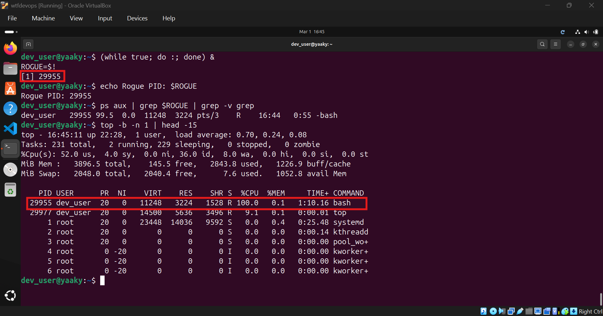
*ps and top showing the rogue PID consuming high CPU%*

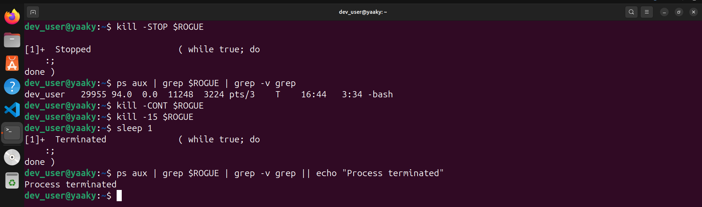
*T state in ps after SIGSTOP, then Process terminated after kill -15*

**Signal Reference:**

| Signal | Number | Behaviour |
|--------|--------|-----------|
| SIGTERM | 15 | Graceful — process can catch and clean up |
| SIGKILL | 9 | Force kill — cannot be caught or ignored |
| SIGSTOP | 19 | Pause/suspend process |
| SIGCONT | 18 | Resume paused process |

**Observation:** Always attempt SIGTERM first. It allows the process to release file locks, close connections, and flush buffers. SIGKILL should only be used as a last resort — it bypasses all cleanup handlers and can leave orphaned resources or locked databases.

---

### Scenario 10 – Incident Documentation via Heredoc

**Context:** Generate a structured incident report using a heredoc directly in the terminal.

#### Commands Executed

```bash
cat > ~/incident_report.txt << 'EOF'
================================================
   PAROCYBER LINUX ASSIGNMENT - INCIDENT REPORT
================================================
PREPARED BY : Yaa Kesewaa Yeboah
DATE        : March 2026

SCENARIO 1 - Shared Document Deletion
  Problem : intern_a deleted a shared file
  Fix     : chattr +i (immutable) and chattr +a (append-only)
  Lesson  : chattr works below chmod — even root is blocked

SCENARIO 2 - Log Overwrite
  Problem : > operator destroyed 100+ lines of logs
  Fix     : chattr +a on log file, cp -p for backups
  Lesson  : Always use >> for logs. Never >.

SCENARIO 3 - Permission Drift
  Problem : cp reset file ownership and timestamps
  Fix     : Use cp -p to preserve metadata
  Lesson  : cp -p or rsync -a for all deployments

SCENARIO 4 - Relative Path Failure
  Problem : Script broke when run from /tmp
  Fix     : Replaced relative path with absolute path
  Lesson  : Absolute paths work from any directory

SCENARIO 5 - Monitoring Failure After Log Cleanup
  Problem : Removing original.log broke symlink monitoring
  Fix     : Use hard links for monitoring continuity
  Lesson  : Hard links survive deletion. Symlinks do not.

SCENARIO 6 - Sensitive Data Exposure
  Problem : Passwords and API keys found in plaintext
  Fix     : Use secrets managers, never log credentials
  Lesson  : grep -r -e -f can scan entire directory trees

SCENARIO 7 - Shared Directory Stability
  Problem : Users deleting each other's files
  Fix     : chmod +t (sticky bit) on shared directory
  Lesson  : Sticky bit restricts deletion to file owner only

SCENARIO 8 - Special Permissions
  Problem : Misuse of setuid, setgid, sticky bit
  Fix     : Apply each bit correctly and audit regularly
  Lesson  : s = setuid active. S = misconfiguration.

SCENARIO 9 - Process Anomaly
  Problem : Rogue process consuming 100% CPU
  Fix     : Identified with ps/top, terminated with kill -15
  Lesson  : Always try SIGTERM before SIGKILL
================================================
EOF

cat ~/incident_report.txt
```

**Evidence:**

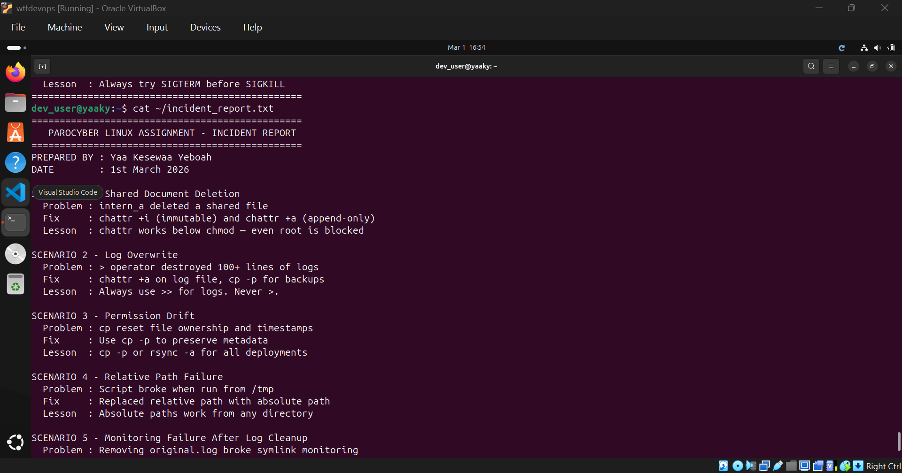
*Full incident_report.txt printed on screen after the heredoc runs*

**Why Heredoc:** The `<< 'EOF'` syntax embeds multi-line text directly in the terminal without creating intermediate files or escaping every line. The quoted delimiter (`'EOF'`) prevents variable expansion inside the block — what you type is exactly what gets written to the file. This is the standard way to generate documentation or config files programmatically in shell scripts.

---

## 🔐 Key Security Concepts Summary

| Concept | Tool / Command | Layer |
|---------|---------------|-------|
| File permissions | `chmod`, `chown`, `chgrp` | DAC (kernel) |
| Extended file attributes | `chattr +i`, `chattr +a`, `lsattr` | VFS filesystem flags |
| Special permission bits | `chmod u+s`, `g+s`, `+t` | DAC (kernel) |
| Process control | `ps`, `top`, `kill` | OS process management |
| Log integrity | `chattr +a`, `cp -p` | Filesystem + operational |
| Secret scanning | `grep -r`, `-e`, `-f` | Operational security |
| Path safety | Absolute paths | Scripting best practices |

---

## 💡 Overall Lessons Learned

Linux security is not a single switch — it works in layers. Each layer adds a different kind of protection:

1. **`chattr` beats `chmod`** — filesystem attributes enforce constraints below the permission layer. Even root cannot bypass them without explicitly removing the attribute first.
2. **Sticky bit separates creation from deletion** — group members can still create files in a shared directory, but cannot delete each other's files.
3. **Uppercase `S` is always a misconfiguration** — if you ever see it on a file, it means setuid was set without an execute bit, which is meaningless and should be flagged.
4. **Hard links survive deletion; symlinks do not** — choose based on whether your tooling needs to survive log rotation.
5. **`>` destroys; `>>` preserves** — default to append in any log or audit pipeline.
6. **Relative paths are environment-dependent** — production scripts must always use absolute paths.
7. **`cp -p` is the minimum safe copy** — use `rsync -a` for full metadata fidelity in backups and deployments.

---

## 📄 References

- [Linux man pages — chattr](https://linux.die.net/man/1/chattr)
- [Linux man pages — chmod](https://linux.die.net/man/1/chmod)
- [Linux man pages — kill](https://linux.die.net/man/1/kill)
- [The Linux Documentation Project](https://tldp.org)

---

*Completed as part of the ParoCyber Linux Assignment, facilitated by Samuel Nartey Otuafo at ParoCyber LLC.*
